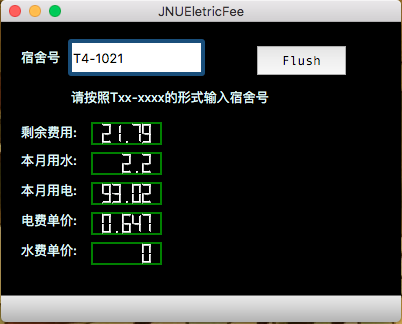

## JNUElectronicFee

This is a simple application implemented by QT5.10 to monitor current eletronic fee status of dormitories in southern campus of Jinan University. Also it is the first application for me to write in QT, study-oriented.  

### Main Parts

- crypt parts: The message sent to the system is encrypted by AES-128, we provide a toolkit to encrypt our message.  
- GetBalance: Get the current balance.  
- GetUsage  

This application is now available in MAC OS, here is the address to download:  

https://pan.baidu.com/s/1pLcbHd5  

### Running

See the picture below:  

</img>

If your balance is below **20.0**, the boxes will turn red!!!

### Future Plan

Now the application collect no information when it is running. I plan to store some necessary information to make it more usable. Moreover, this application needs a better UI, any great design, please contact me.  

The windows version is not available at this moment. This is the last year for me in Jinan University, I hope there is someone to help me dealing with this issues and finish this great application.  
